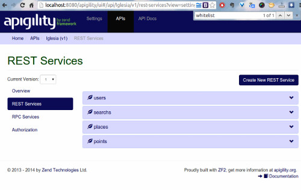

# my-apigility

Deploy Apigility by zendframework REST-SERVICE  into 'Code-Connected and DB-Connected'

Example manager table : users, searchs, points, places  `trigger`


## Install Apigility

[Apigility official](https://apigility.org/)


## Install DB

Access MYSQL: `user : root` `password : 123456`


```sql
CREATE DATABASE iglesia-bb;
USE iglesia-bb;
```

Execute SQL by shell or phpAdmin the file is in :

    data/iglesia-bb.sql


## Other Install

```bash
composer.phar install
```

```bash
cd path/to/install
php -S 127.0.0.1:8080 -t public public/index.php
```

Image reference:


